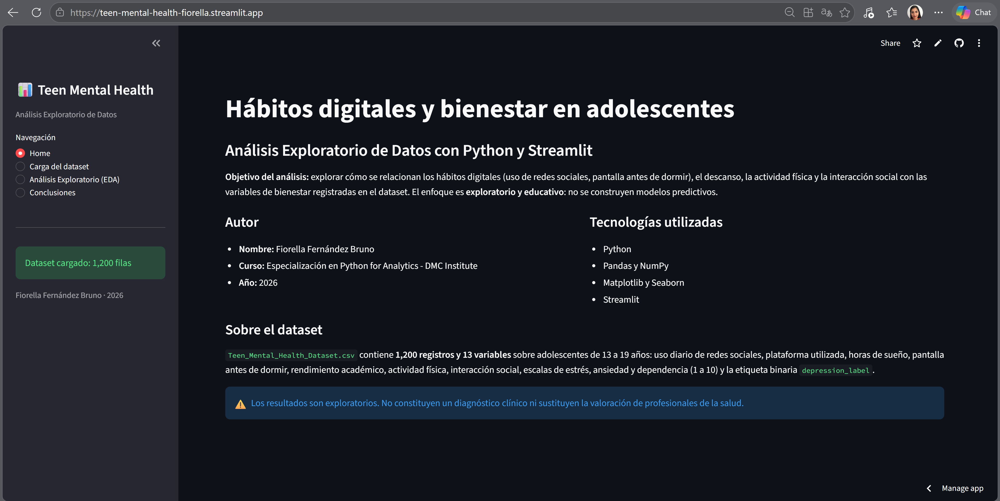
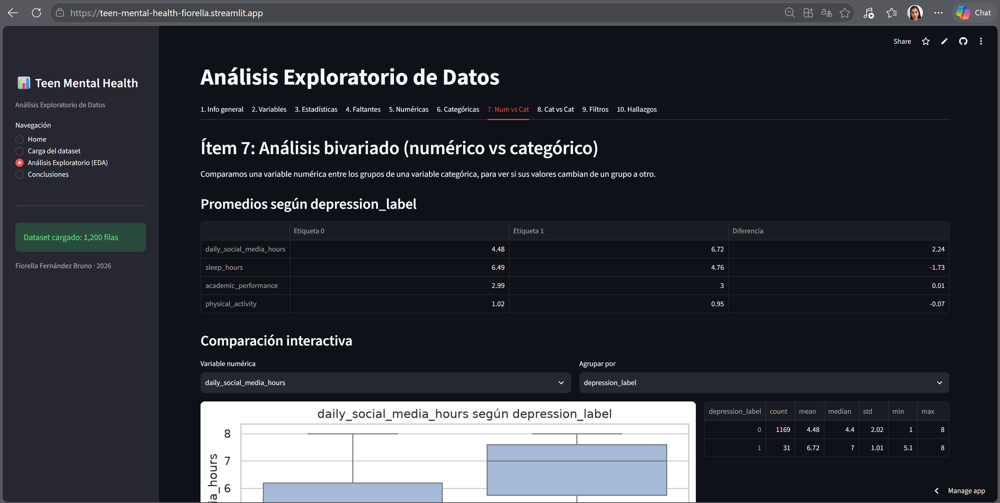
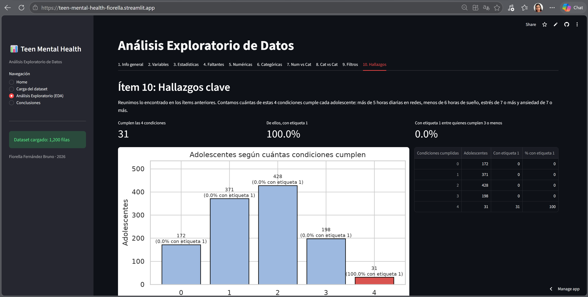
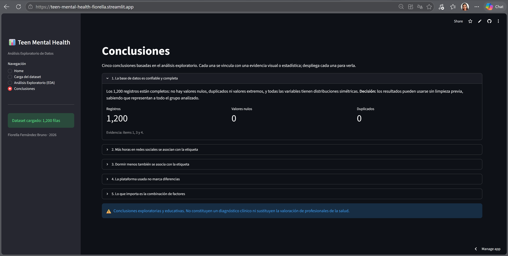

# Hábitos digitales y bienestar en adolescentes

Aplicación interactiva en **Streamlit** para el Análisis Exploratorio de Datos (EDA) del dataset `Teen_Mental_Health_Dataset.csv`. Explora cómo se relacionan el uso de redes sociales, el sueño, la actividad física y la interacción social con las variables de bienestar de 1,200 adolescentes de 13 a 19 años.

El enfoque es **exploratorio y educativo**: no se construyen modelos predictivos y los resultados no constituyen un diagnóstico clínico.

**Autora:** Fiorella Fernández Bruno
**Curso:** Especialización en Python for Analytics - DMC Institute (2026)

## Links

- **Aplicación desplegada:** https://teen-mental-health-fiorella.streamlit.app
- **Repositorio:** https://github.com/Fiorella-Fernandez-Bruno/teen-mental-health

## Capturas

### Home


### Análisis Exploratorio (EDA)


### Hallazgos clave


### Conclusiones


## Estructura de la aplicación

| Módulo | Contenido |
|---|---|
| Home | Objetivo, autora, dataset y tecnologías |
| Carga del dataset | Carga y validación del CSV, vista previa y dimensiones |
| Análisis Exploratorio | 10 ítems de análisis organizados en pestañas |
| Conclusiones | 5 conclusiones con su evidencia visual o estadística |

**Ítems del EDA:** información general · clasificación de variables · estadísticas descriptivas · valores faltantes · distribución de variables numéricas · variables categóricas · numérico vs categórico · categórico vs categórico · análisis con filtros · hallazgos clave.

## Variables principales

| Variable | Descripción |
|---|---|
| `age` | Edad (13 a 19 años) |
| `gender` | Género registrado |
| `daily_social_media_hours` | Horas diarias en redes sociales |
| `platform_usage` | Plataforma: Instagram, TikTok o ambas |
| `sleep_hours` | Horas de sueño por día |
| `screen_time_before_sleep` | Horas de pantalla antes de dormir |
| `academic_performance` | Indicador de rendimiento académico |
| `physical_activity` | Horas de actividad física |
| `social_interaction_level` | Interacción social: low, medium, high |
| `stress_level` | Estrés (escala 1 a 10) |
| `anxiety_level` | Ansiedad (escala 1 a 10) |
| `addiction_level` | Dependencia o uso problemático (escala 1 a 10) |
| `depression_label` | Etiqueta binaria: 0 = ausencia, 1 = presencia |

## Hallazgo principal

La etiqueta `depression_label = 1` aparece solo en los 31 adolescentes que cumplen a la vez cuatro condiciones: más de 5 horas diarias en redes, menos de 6 horas de sueño, estrés de 7 o más y ansiedad de 7 o más. La plataforma usada no marca diferencias.

## Cómo ejecutarla

**En línea.** Abre la [aplicación desplegada](https://teen-mental-health-fiorella.streamlit.app), entra a **Carga del dataset** y sube el archivo `Teen_Mental_Health_Dataset.csv`, descargado de este repositorio o desde OneDrive.

## Tecnologías

Python · Pandas · NumPy · Matplotlib · Seaborn · Streamlit

## Archivos

```
teen-mental-health/
├── app.py
├── requirements.txt
├── Teen_Mental_Health_Dataset.csv
├── README.md
└── capturas/
```
